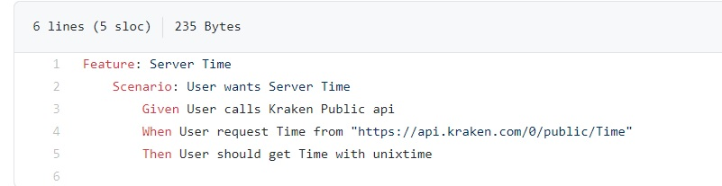

# Kraken APi report  
Uses Behat for testing.

Download or clone
Download the zip file or [Clone](https://github.com/thekuldeepjoshi/kraken_api_report) this or opne with github desktop

In your terminal type the following.  
## $ Docker-compose up
This will start docker image.

Redirect to Vendor/bin and use behat command to run the test file.
## $ cd "work_root"/vendor/bin behat

Example of feture file. 
vendor/bin/features/bootstrap/servertime.feature

